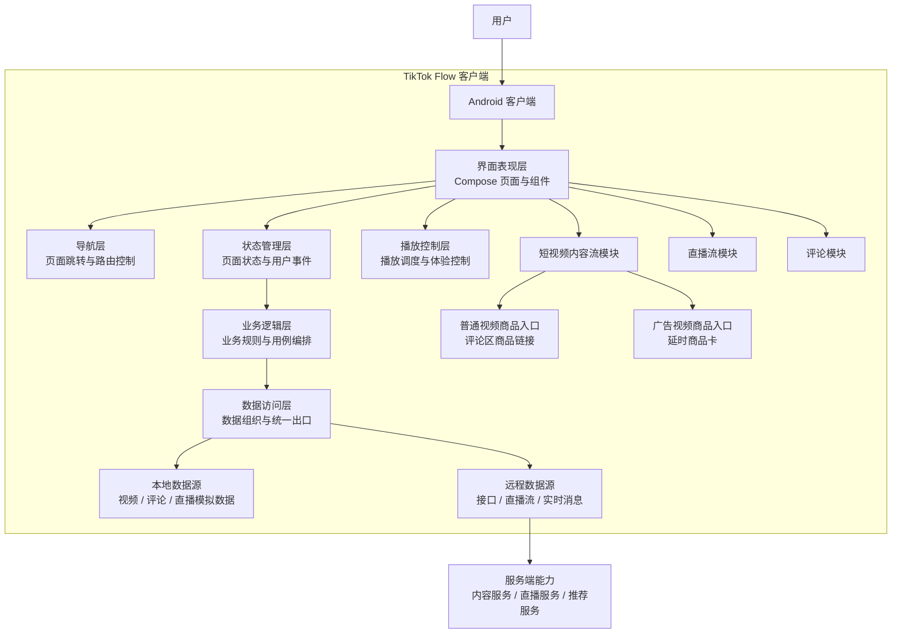
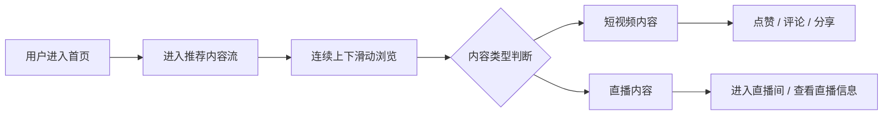
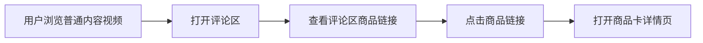
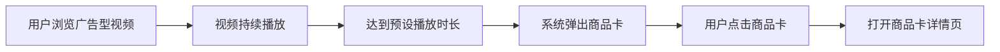
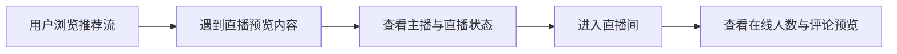

# TikTok Flow 项目技术方案文档

## 1. 文档说明

### 1.1 文档目的
本文档作为项目开发前的技术方案说明，用于统一项目背景、建设目标、功能范围、系统架构、模块边界与实施方向。

本文档不绑定具体代码文件与类结构，但会说明必要的实现逻辑，主要用于：
- 项目立项与需求澄清
- 团队成员分工协作
- 开发前架构设计确认
- 后续详细设计与编码工作的输入依据

### 1.2 适用范围
本文档适用于 `TikTok Flow` 项目的内容流与直播流建设阶段，重点面向客户端产品原型与核心交互链路设计。

### 1.3 文档定位
本文档属于“编码前技术设计文档”，处于需求文档与详细实现文档之间，强调：
- 讲清做什么
- 讲清为什么这样设计
- 讲清模块如何划分
- 讲清后续实现应遵循的结构约束

---

## 2. 项目背景

### 2.1 项目概述
`TikTok Flow` 是一个面向移动端的内容消费项目，核心关注两个主场景：
- 短视频内容流
- 直播内容流

项目目标是构建一个具有沉浸式浏览体验的内容平台原型，让用户能够在连续滑动中浏览短视频与直播内容，并通过评论区链接或商品卡浮层接触商品信息。

### 2.2 项目边界
本项目聚焦“内容展示与互动体验”，不覆盖完整电商交易闭环。

本文档范围内包含：
- 内容流展示
- 直播流展示
- 评论互动
- 商品信息入口
- 推荐与播放体验优化

本文档范围外不包含：
- 购物车
- 订单系统
- 支付系统
- 商家后台
- 完整商品交易链路

### 2.3 建设目标
本项目的建设目标包括：
- 搭建统一的短视频与直播流展示框架
- 提供流畅的上下滑浏览体验
- 建立内容与商品信息之间的轻量连接方式
- 形成可扩展的推荐、直播和互动架构
- 为后续工程实现提供清晰、稳定的设计基线

---

## 3. 业务目标与设计原则

### 3.1 业务目标
项目围绕“内容消费体验”展开，主要目标如下：
- 提升用户在内容流中的停留时长
- 增强直播场景的沉浸感和互动感
- 让商品信息自然嵌入内容消费过程
- 降低商品信息对主内容体验的打扰
- 为后续推荐与实时互动预留演进空间

### 3.2 设计原则

#### 以内容为主
内容浏览始终是第一优先级，商品信息只作为附加能力出现，不应破坏主内容体验。

#### 统一交互体验
短视频与直播流在操作方式上尽量保持一致，例如上下滑动、进入详情、查看评论等，减少用户学习成本。

#### 轻量商品触达
商品入口设计以“轻量触达”为原则，强调自然嵌入，而不是强制打断。

#### 可扩展架构
系统结构需要支持未来增加推荐策略、远程接口、实时互动能力以及更复杂的内容类型。

#### 先方案、后实现
在编码前先明确系统边界、模块职责与关键流程，避免实现阶段反复返工。

---

## 4. 功能范围定义

### 4.1 核心功能范围
当前阶段的功能范围包括：
- 短视频内容流展示
- 直播内容流展示
- 评论区浏览与互动入口
- 商品卡与商品链接入口
- 用户行为采集预留
- 推荐能力预留
- 播放体验优化预留

### 4.2 非目标范围
当前阶段不纳入建设范围的内容包括：
- 交易系统
- 商品库存系统
- 支付结算系统
- 营销活动系统
- 创作者后台管理

---

## 5. 内容形态设计

### 5.1 内容流类型
项目中的内容流由两类内容组成：
- 短视频内容
- 直播内容

短视频用于连续浏览和消费，直播用于增强实时互动感和平台氛围。

### 5.2 短视频中的两类视频定义
在短视频内容中，进一步定义两类视频形态：

#### 类型一：普通内容视频
普通内容视频在播放和浏览体验上与常规短视频一致，主要特点如下：
- 视频本身不主动展示商品卡
- 用户可以正常浏览、点赞、评论、分享
- 商品信息仅通过评论区中的链接出现
- 用户点击评论区链接后，可进入商品卡详情页

该类型适用于“内容优先”的展示场景，强调信息弱干扰。

#### 类型二：广告型视频
广告型视频在基础播放体验上与普通内容视频一致，但增加了商品触达能力，主要特点如下：
- 视频可以先按正常内容进行播放
- 当播放达到设定时长后，界面自动弹出商品卡
- 商品卡以浮层形式展示，不中断主播放流程
- 用户点击商品卡后，可进入商品卡详情页

该类型适用于“内容承接 + 商品曝光”的展示场景。

### 5.3 两类视频的差异总结

| 维度 | 普通内容视频 | 广告型视频 |
| --- | --- | --- |
| 播放体验 | 与普通视频一致 | 与普通视频一致 |
| 商品入口位置 | 评论区链接 | 播放中浮层商品卡 |
| 商品触发方式 | 用户主动点击评论区 | 系统按时机自动弹出 |
| 打扰程度 | 低 | 中等 |
| 适用场景 | 内容优先 | 商品曝光优先 |

---

## 6. 直播流设计

### 6.1 直播流定位
直播流用于在内容平台中补充实时性与互动性，形成与短视频不同的浏览体验。

直播内容可以作为推荐流中的一类内容插入，也可以通过直播预览入口进入直播间页面。

### 6.2 直播流目标
直播流需要满足以下目标：
- 展示主播身份与直播状态
- 展示在线人数与实时氛围
- 支持评论预览与互动感营造
- 保持与内容流一致的沉浸式视觉风格

### 6.3 直播流与短视频流的关系
短视频流与直播流属于同一内容系统中的不同内容类型：
- 短视频流偏重连续消费
- 直播流偏重实时停留与互动氛围

二者在上层体验上统一，在内容属性上区分。

---

## 7. 商品入口设计

### 7.1 设计目标
商品能力在本项目中不是独立业务系统，而是内容附带的信息触达能力。

其设计目标是：
- 让商品信息与内容自然关联
- 通过轻量入口承接用户兴趣
- 不破坏主内容浏览流程

### 7.2 商品入口形式
本项目定义两种商品入口：

#### 评论区商品链接
适用于普通内容视频。商品信息嵌入评论区，由用户主动发现和点击。

#### 延时弹出的商品卡
适用于广告型视频。商品卡在合适的播放时机出现，用于承接用户已经建立的兴趣。

### 7.3 商品入口触发流程

#### 普通内容视频流程
1. 用户浏览视频内容
2. 用户进入评论区
3. 评论区展示商品链接
4. 用户点击商品链接
5. 系统打开商品卡详情页

#### 广告型视频流程
1. 用户浏览广告型视频
2. 视频播放达到预设时长
3. 系统弹出商品卡浮层
4. 用户点击商品卡
5. 系统打开商品卡详情页

### 7.4 设计约束
商品入口设计应遵循以下约束：
- 不能遮挡核心播放信息过久
- 不能频繁重复打扰用户
- 入口样式需要与整体内容界面统一
- 不应把商品卡设计成完整交易页面

---

## 8. 总体架构设计

### 8.1 架构目标
总体架构设计需要支撑以下目标：
- 支撑内容流与直播流两类业务
- 支撑多种内容入口形式
- 支撑未来接入远程服务与实时能力
- 便于分层开发与模块协作

### 8.2 项目总体架构图



### 8.3 分层说明

#### 界面表现层
负责内容展示、页面结构、视觉呈现和交互反馈，是用户直接感知系统的部分。

#### 导航层
负责不同页面与功能模块之间的跳转组织，确保内容流、评论、直播与商品详情之间可以顺畅切换。

#### 状态管理层
负责承接用户操作、维护页面状态、向上响应业务事件、向下驱动页面刷新。

#### 播放控制层
负责统一管理内容播放体验，包括自动播放、暂停、切换和预加载等播放相关能力。

#### 业务逻辑层
负责业务规则定义、流程编排和内容类型判断，例如不同视频类型的商品入口策略。

#### 数据访问层
负责统一组织本地数据与未来远程数据，为上层提供一致的数据出口。

#### 数据源层
包含本地模拟数据与未来远程服务数据，是系统内容的来源。

---

## 9. 页面与交互实现逻辑

### 9.1 首页整体结构
首页采用单入口内容流结构，用户进入应用后默认进入推荐内容流。页面由以下几个视觉层组成：
- 顶部导航区
- 中央内容展示区
- 右侧互动操作区
- 底部信息区
- 底部导航区

其中，中央内容展示区根据内容类型动态切换为“短视频页”或“直播预览页”。

### 9.2 短视频页实现逻辑
短视频页是标准内容页，核心逻辑如下：
- 每次只聚焦当前停留的视频项
- 当前项进入稳定状态后开始播放
- 上下滑动切换内容时，旧内容停止活跃状态，新内容进入活跃状态
- 页面基础交互包括点赞、评论、分享和作者信息查看
- 商品入口根据视频类型决定显示方式

### 9.3 直播预览页实现逻辑
直播预览页作为内容流中的一种特殊内容项，核心逻辑如下：
- 在推荐流中以直播卡片或直播预览页形式出现
- 需要突出直播状态、主播身份和在线氛围
- 用户可直接进入直播间详情页
- 直播内容在内容流中承担“实时内容插入”的作用，而不是完全独立于推荐流

### 9.4 评论区实现逻辑
评论区承担两类职责：
- 承载普通评论浏览与互动
- 承载普通内容视频中的商品链接入口

评论区与主视频页解耦，但必须与当前内容上下文保持一致，即：
- 打开什么内容，就展示对应内容的评论
- 商品链接与当前内容绑定

### 9.5 商品卡实现逻辑
商品卡只作为内容信息扩展层出现，不承担完整交易职责。其实现逻辑分为两类：

#### 普通内容视频
- 商品信息不直接在主视频区展示
- 评论区加载时一并展示商品链接信息
- 商品链接点击后进入商品卡详情页

#### 广告型视频
- 播放开始时不立即出现商品卡
- 当播放达到设定阈值后，系统触发商品卡展示
- 商品卡显示在视频内容之上，但不完全遮挡核心画面
- 用户可点击进入商品卡详情页，也可继续忽略后浏览内容

---

## 10. 模块划分设计

### 10.1 模块划分目标
模块划分的目标是降低耦合、提升扩展性，并让团队成员可以围绕明确边界并行推进。

### 10.2 核心模块
系统可划分为以下核心模块：
- 内容流模块
- 直播流模块
- 评论模块
- 商品入口模块
- 播放控制模块
- 数据组织模块
- 推荐能力预留模块

### 10.3 模块职责说明

#### 内容流模块
负责短视频内容的展示、滑动浏览、基础互动以及两类视频的内容编排。

#### 直播流模块
负责直播预览、直播间展示、主播信息和直播氛围的呈现。

#### 评论模块
负责评论展示、评论浏览、评论互动入口以及普通视频中的商品链接承载。

#### 商品入口模块
负责商品链接、商品卡、商品卡跳转等与商品信息触达相关的轻量能力。

#### 播放控制模块
负责内容播放、页面切换、播放节奏和体验稳定性。

#### 数据组织模块
负责内容数据、直播数据、评论数据和商品入口配置数据的统一管理。

#### 推荐能力预留模块
负责为后续兴趣识别、内容排序、内容混排提供结构空间。

---

## 11. 数据模型与状态流设计

### 11.1 内容模型设计
从业务逻辑出发，系统中的内容对象至少需要具备以下信息：
- 内容唯一标识
- 内容类型
- 作者或主播信息
- 内容标题与描述
- 封面与播放资源信息
- 评论入口信息
- 商品入口信息
- 行为统计信息

其中，内容类型应至少区分：
- 短视频
- 直播

短视频类型下还应进一步区分：
- 普通内容视频
- 广告型视频

### 11.2 商品入口配置模型
为了支持两类视频的差异化触达方式，商品入口配置至少需要表达以下逻辑信息：
- 是否存在商品信息
- 商品入口类型
- 商品详情标识
- 商品卡触发延时
- 商品入口文案或引导信息

### 11.3 评论模型设计
评论模型除常规评论内容外，还应支持：
- 与当前内容关联
- 商品链接附加展示
- 评论区中的轻量互动能力

### 11.4 页面状态设计
页面状态建议分为以下几类：
- 内容加载状态
- 当前内容索引状态
- 当前播放状态
- 评论区展开状态
- 商品卡显示状态
- 直播间进入状态

### 11.5 状态流转逻辑
内容流场景中的核心状态流转逻辑如下：
1. 页面初始化
2. 加载内容列表
3. 默认激活首个内容项
4. 用户滑动切换内容
5. 更新当前内容索引
6. 更新当前播放状态
7. 根据内容类型触发对应交互能力

对于广告型视频，还会多一层状态流转：
1. 视频开始播放
2. 播放时间累计
3. 达到触发阈值
4. 商品卡显示状态切换为可见

---

## 12. 核心业务流程

### 12.1 内容流浏览流程



### 12.2 普通内容视频商品流程



### 12.3 广告型视频商品流程



### 12.4 直播流浏览流程



## 13. 关键技术实现策略

### 13.1 内容流混排策略
系统需要支持同一推荐流中混合出现多种内容，因此在实现上建议采用统一内容容器，按内容类型动态渲染。这样做的价值在于：
- 统一推荐流入口
- 统一滑动逻辑
- 降低不同内容类型之间的切换成本
- 为后续增加新内容类型保留空间

### 13.2 播放控制策略
播放控制应采用“单活跃内容”原则：
- 任意时刻只允许当前稳定停留内容处于播放状态
- 滑动切换时，旧内容退出活跃态，新内容进入活跃态
- 非当前内容不应持续占用播放资源

这一策略主要用于解决：
- 切换时多个内容同时发声
- 内容切换卡顿
- 播放状态不一致

### 13.3 商品卡触发策略
广告型视频的商品卡触发建议采用“延时触发 + 单次展示”原则：
- 从视频开始播放后开始计时
- 达到设定阈值后触发商品卡显示
- 单次浏览过程中避免高频重复弹出
- 当用户快速滑走当前内容时，触发流程立即失效

### 13.4 评论区商品链接策略
普通内容视频的商品入口建议采用“内容弱耦合、评论承载”的方式：
- 视频主画面不展示明显商品入口
- 商品信息放置在评论区中
- 用户主动进入评论区后再触发商品接触

该策略可以保证普通内容视频的内容优先级。

### 13.5 直播流接入策略
直播流在实现上建议分两阶段推进：

#### 第一阶段
- 先以本地或模拟数据实现直播预览与直播间展示
- 先跑通内容混排、页面切换和视觉结构

#### 第二阶段
- 再接入真实直播流地址
- 补充实时评论、在线人数变化和直播状态同步

这种分阶段方式可以降低一次性实现复杂度。

### 13.6 推荐能力预留策略
当前阶段推荐能力不要求完整落地，但结构上需要预留：
- 用户行为采集入口
- 内容排序字段
- 内容类型混排能力
- 推荐插入位

这样可以避免后续推荐能力接入时推翻现有结构。

---

## 14. 性能与体验设计

### 14.1 体验目标
项目需要重点保障以下体验：
- 内容切换流畅
- 播放响应及时
- 不出现明显卡顿或黑屏
- 评论区与直播流切换自然
- 商品卡展示不影响主要浏览节奏

### 14.2 关键优化方向
在技术实现阶段应重点关注以下方向：
- 播放控制统一管理
- 邻近内容预加载
- 页面切换节奏控制
- 直播与短视频共存时的播放调度
- 商品浮层的展示时机与消失策略

### 14.3 优化实施逻辑
为保证内容流体验稳定，建议从以下顺序进行优化：
1. 先保证播放状态切换正确
2. 再解决滑动过程中的卡顿问题
3. 再优化商品卡展示时机
4. 最后处理直播流与短视频流的混排体验

### 14.4 视觉体验要求
在视觉和交互体验上建议保持以下方向：
- 内容界面沉浸式
- 信息层级清晰
- 直播氛围明显
- 商品信息轻量但可感知
- 评论、直播、商品三类信息层互不冲突

---

## 15. 未来扩展方向

### 15.1 内容能力扩展
后续可扩展更多内容类型，例如：
- AI 推荐卡片
- 专题页内容
- 活动型内容

### 15.2 直播能力扩展
后续可扩展：
- 实时评论
- 点赞动画
- 实时在线人数变化
- 直播状态同步

### 15.3 推荐能力扩展
后续可扩展：
- 兴趣标签识别
- 用户行为分析
- 内容排序优化
- 短视频与直播混排策略

### 15.4 数据能力扩展
后续可扩展：
- 远程接口
- 实时消息通道
- 内容管理后台对接
- 推荐服务接入

## 16. 实施建议

### 16.1 建议实施顺序
建议按以下顺序推进：
1. 明确内容流与直播流的统一页面结构
2. 明确普通视频与广告视频的业务规则
3. 完成商品入口触发流程设计
4. 搭建统一的状态管理与播放控制框架
5. 再进入详细实现与编码阶段

### 16.2 分阶段落地建议
建议按三个阶段实施：

#### 第一阶段：基础能力搭建
- 完成内容流页面结构
- 完成普通视频与广告视频区分
- 完成评论区与直播预览基础交互

#### 第二阶段：商品入口能力搭建
- 接入评论区商品链接
- 接入广告型视频商品卡
- 建立商品详情页跳转链路

#### 第三阶段：体验与扩展能力搭建
- 优化播放切换体验
- 增加直播流真实数据能力
- 预留推荐与行为采集能力

### 16.3 开发前确认项
在正式编码前，建议先确认以下内容：
- 两类视频的业务边界是否稳定
- 商品卡详情页的展示范围是否明确
- 直播流是否作为内容流插入项存在
- 是否需要在首期就预留远程接口形式
- 推荐能力是否在当前阶段仅保留结构预留

---

## 17. 风险与注意事项

### 17.1 业务风险
- 商品入口过强可能破坏内容体验
- 直播流与短视频流混排可能增加用户理解成本
- 两类视频差异如果定义不清，会直接影响实现逻辑一致性

### 17.2 架构风险
- 若前期没有明确模块边界，后续容易出现功能耦合
- 若播放控制没有统一设计，后续容易出现体验问题
- 若商品入口缺少统一规则，界面会出现不一致

### 17.3 实施风险
- 若先写代码再补方案，容易造成返工
- 若内容、评论、商品卡入口分别独立设计，可能缺乏整体一致性

---

## 18. 结论
`TikTok Flow` 当前适合作为一个“内容流 + 直播流”的移动端方案项目推进。

该项目的核心不是构建完整电商系统，而是在内容消费体验中设计两类商品信息触达方式：
- 普通内容视频通过评论区商品链接触达商品信息
- 广告型视频通过延时弹出的商品卡触达商品信息

从架构上看，项目应围绕“内容流、直播流、评论模块、商品入口、播放控制、数据组织”六个方向建立统一方案。

从实施路径看，应先完成方案设计和边界确认，再进入详细实现与编码阶段。这样可以降低返工成本，并保证后续开发具备统一的技术依据。

---

## 19. 广告视频接口字段补充

推荐流中的广告视频与普通视频使用同一套播放接口和滑动容器，差异由视频条目的广告元数据控制。客户端收到广告条目后仍按普通视频加载播放资源，只在底部信息区额外展示广告标识和跳转链接。

### 19.1 视频条目新增字段

| 字段 | 类型 | 是否必填 | 说明 |
| --- | --- | --- | --- |
| `assetDirectory` | `String` | 本地 mock 必填 | 本地资源目录。普通视频为 `vidoe`，直播预览为 `live`，广告视频为 `ad`。真实接口可替换为远程资源 URL 字段。 |
| `isAdvertisement` | `Boolean` | 否 | 是否为广告视频。默认 `false`。为 `true` 时展示广告样式。 |
| `adLabel` | `String` | 否 | 广告披露标签文案，当前默认展示为 `广告`。 |
| `actionLinkText` | `String` | 广告视频必填 | 底部跳转链接按钮文案，当前本地 mock 使用 `查看详情`。 |
| `actionLinkUrl` | `String` | 广告视频必填 | 底部跳转链接地址，当前本地 mock 使用 `tiktokflow://ad/{adId}`。 |

### 19.2 本地 mock 示例

```json
{
  "videoId": "ad_video_4",
  "videoLink": "4.mp4",
  "assetDirectory": "ad",
  "isAdvertisement": true,
  "adLabel": "广告",
  "actionLinkText": "查看详情",
  "actionLinkUrl": "tiktokflow://ad/4"
}
```
